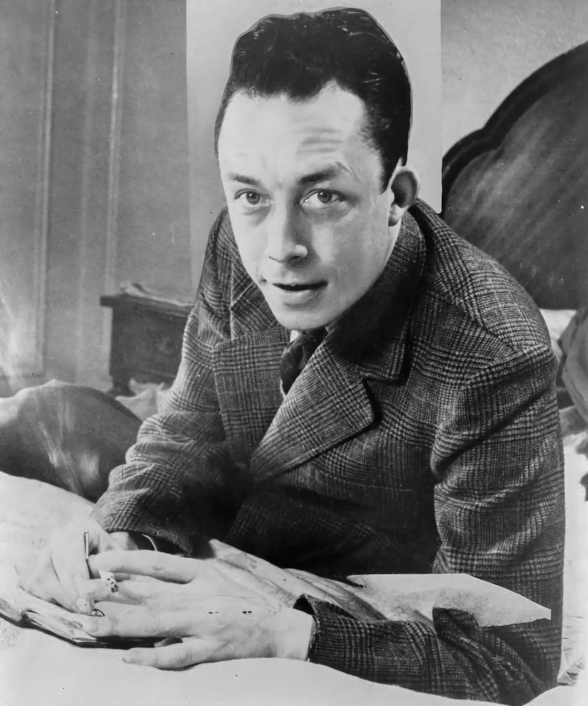

# L’Étranger

## Albert Camus

<figure><figcaption>
Albert Camus en 1957.
</figcaption></figure>

 [Albert Camus](https://fr.wikipedia.org/wiki/Albert\_Camus) (en [arabe](https://fr.wikipedia.org/wiki/Arabe) : ألبير كامو), né le [7](https://fr.wikipedia.org/wiki/7\_novembre) [novembre](https://fr.wikipedia.org/wiki/Novembre\_1913) [1913](https://fr.wikipedia.org/wiki/1913) à [Mondovi](https://fr.wikipedia.org/wiki/Mondovi\_\(Alg%C3%A9rie\)) (aujourd’hui [Dréan](https://fr.wikipedia.org/wiki/Dr%C3%A9an)) en [Algérie](https://fr.wikipedia.org/wiki/Alg%C3%A9rie\_fran%C3%A7aise), et mort accidentellement le [4](https://fr.wikipedia.org/wiki/4\_janvier) [janvier](https://fr.wikipedia.org/wiki/Janvier\_1960) [1960](https://fr.wikipedia.org/wiki/1960) à [Villeblevin](https://fr.wikipedia.org/wiki/Villeblevin), est un écrivain, [philosophe](https://fr.wikipedia.org/wiki/Philosophe), [romancier](https://fr.wikipedia.org/wiki/Roman\_\(litt%C3%A9rature\)), [dramaturge](https://fr.wikipedia.org/wiki/Dramaturge), [essayiste](https://fr.wikipedia.org/wiki/Essai) et [nouvelliste](https://fr.wikipedia.org/wiki/Nouvelle) [français](https://fr.wikipedia.org/wiki/France). Il est aussi [journaliste](https://fr.wikipedia.org/wiki/Journaliste) [militant](https://fr.wikipedia.org/wiki/Militantisme) engagé dans la [Résistance française](https://fr.wikipedia.org/wiki/R%C3%A9sistance\_fran%C3%A7aise) et proche des [courants libertaires](https://fr.wikipedia.org/wiki/Libertaire) dans les combats moraux de l'[après-guerre](https://fr.wikipedia.org/wiki/Apr%C3%A8s-guerre).

Son œuvre comprend des [pièces de théâtre](https://fr.wikipedia.org/wiki/Pi%C3%A8ce\_de\_th%C3%A9%C3%A2tre), des romans, des [nouvelles](https://fr.wikipedia.org/wiki/Nouvelle), des films, des [poèmes](https://fr.wikipedia.org/wiki/Art\_po%C3%A9tique) et des essais dans lesquels il développe un [humanisme](https://fr.wikipedia.org/wiki/Humanisme) fondé sur la [prise de conscience](https://fr.wikipedia.org/wiki/Conscience) de l'[absurde](https://fr.wikipedia.org/wiki/Absurde) de la [condition humaine](https://fr.wikipedia.org/wiki/Humanit%C3%A9) mais aussi sur la [révolte](https://fr.wikipedia.org/wiki/R%C3%A9volte) comme réponse à l'absurde, révolte qui conduit à l'action et donne un sens au monde et à l'existence. Il reçoit le [prix Nobel de littérature](https://fr.wikipedia.org/wiki/Prix\_Nobel\_de\_litt%C3%A9rature) en 1957.

Dans le journal [_Combat_](https://fr.wikipedia.org/wiki/Combat\_\(journal\)), il prend position aussi bien sur la question de l'[indépendance de l'Algérie](https://fr.wikipedia.org/wiki/Guerre\_d'Alg%C3%A9rie) que sur ses rapports avec le [Parti communiste algérien](https://fr.wikipedia.org/wiki/Parti\_communiste\_alg%C3%A9rien), qu'il quitte après un court passage de deux ans. Il proteste successivement contre les inégalités et la misère qui frappent les [musulmans](https://fr.wikipedia.org/wiki/Islam) d'[Afrique du Nord](https://fr.wikipedia.org/wiki/Afrique\_du\_Nord), puis contre la caricature du [pied-noir](https://fr.wikipedia.org/wiki/Pieds-noirs) exploiteur, tout en prenant la défense des [Espagnols exilés antifascistes](https://fr.wikipedia.org/wiki/Retirada), des victimes du [stalinisme](https://fr.wikipedia.org/wiki/Stalinisme) et des [objecteurs de conscience](https://fr.wikipedia.org/wiki/Objection\_de\_conscience). En marge de certains courants philosophiques, Camus est d'abord témoin de son temps et ne cesse de lutter contre les idéologies et les abstractions qui détournent de l'humain. Il est ainsi amené à s'opposer aussi bien au [libéralisme](https://fr.wikipedia.org/wiki/Lib%C3%A9ralisme) qu’à l'[existentialisme](https://fr.wikipedia.org/wiki/Existentialisme) et au [marxisme](https://fr.wikipedia.org/wiki/Marxisme). Sa critique du [totalitarisme](https://fr.wikipedia.org/wiki/Totalitarisme) [soviétique](https://fr.wikipedia.org/wiki/Sovi%C3%A9tiques) lui vaut les [anathèmes](https://fr.wikipedia.org/wiki/Anath%C3%A8me) de [communistes](https://fr.wikipedia.org/wiki/Communisme) et sa rupture avec [Jean-Paul Sartre](https://fr.wikipedia.org/wiki/Jean-Paul\_Sartre).
